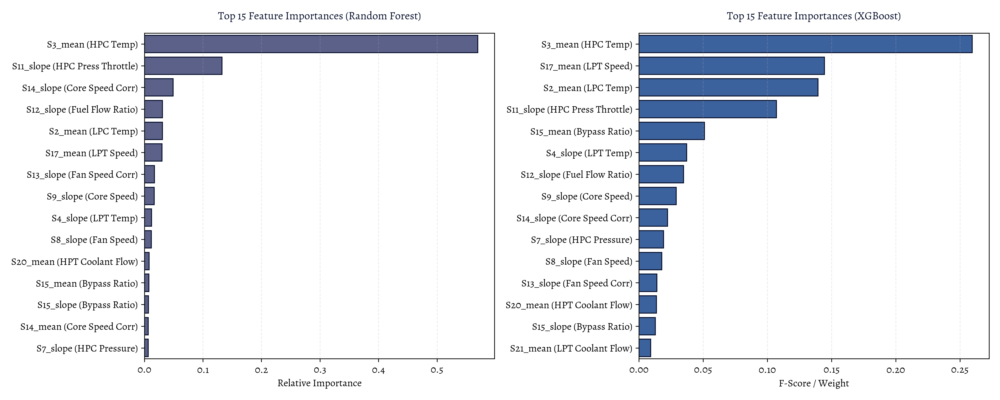
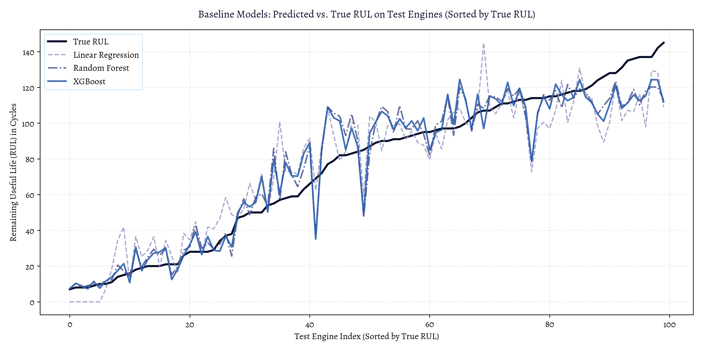
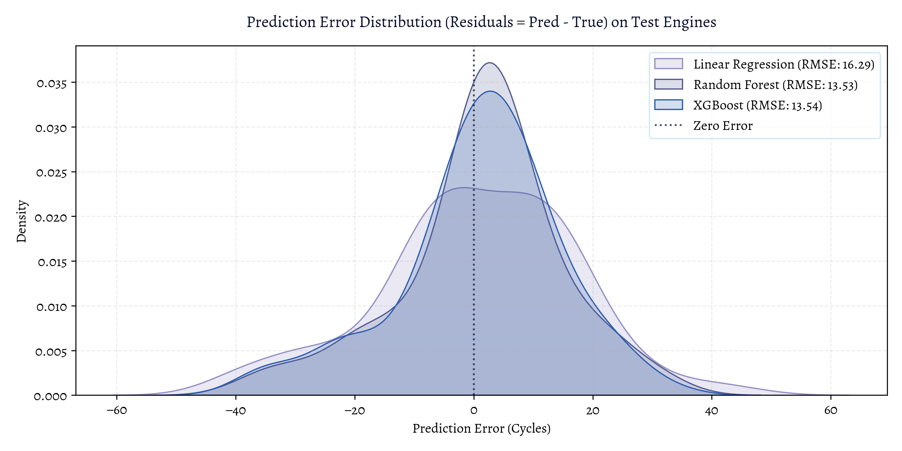

# Classical Machine Learning Baseline Report: NASA C-MAPSS Dataset (FD001)

This report provides a comprehensive explanation of the baseline model building carried out in **02_baseline_model.ipynb**. It covers feature engineering, baseline model training, performance comparison, feature importance, and error distribution analysis, including interpretations and key code blocks.

---

## 1. Load Preprocessed Sliding Windows & Feature Engineering

To train classical machine learning models, the time-series sensor data must be structured into static feature vectors. This is achieved by creating sliding windows and computing rolling statistics.

### Key Code Block (Preprocessing & Feature Extraction)
```python
# Run preprocessing (outputs X_train, y_train, X_test, y_test as .npy files)
X_train, y_train, X_test, y_test = preprocess_data_and_save_npy(
    subset='FD001', 
    raw_dir='../data/raw', 
    processed_dir='../data/processed',
    window_size=30,
    cap=125
)

# Extract rolling features
X_train_feat = extract_rolling_features(X_train)
X_test_feat = extract_rolling_features(X_test)
```

### Interpretation
- **Target Capping (Piecewise RUL)**: RUL is capped at 125 cycles. This stops the model from attempting to learn degradation patterns during early, stable cycles where no actual wear has occurred, focusing the training on the active wear phase.
- **Sliding Window of 30**: A window size of 30 cycles is used to extract sequences. For the training set, all overlapping windows are used (17,731 samples). For the test set, only the last window of size 30 is extracted for each of the 100 engines to predict their RUL at the truncation point.
- **Rolling Features (42 Dimensions)**: For each window of size 30 across 14 kept sensors, we compute the **mean** (current level), **standard deviation** (sensor noise/variance), and **slope/trend** (rate of change). This flattens the 3D sequence array `(N, 30, 14)` into a 2D feature matrix `(N, 42)`.

---

## 2. Baseline Model Training & Evaluation

Three baseline models are trained: a simple Linear Regression model, a Random Forest ensemble, and an XGBoost Regressor. Predictions are clipped at 0 since RUL cannot physically be negative.

### Key Code Block (Model Fitting & Prediction)
```python
# Model 1: Linear Regression
lr_model = LinearRegression()
lr_model.fit(X_train_feat, y_train)
lr_pred_test = np.clip(lr_model.predict(X_test_feat), 0, None)

# Model 2: Random Forest
rf_model = RandomForestRegressor(n_estimators=100, max_depth=12, random_state=42, n_jobs=-1)
rf_model.fit(X_train_feat, y_train)
rf_pred_test = np.clip(rf_model.predict(X_test_feat), 0, None)

# Model 3: XGBoost
xgb_model = XGBRegressor(n_estimators=100, max_depth=5, learning_rate=0.05, random_state=42, n_jobs=-1)
xgb_model.fit(X_train_feat, y_train)
xgb_pred_test = np.clip(xgb_model.predict(X_test_feat), 0, None)
```

### Summary of Model Results

| Model | Train RMSE (Cycles) | Test RMSE (Cycles) | Test PHM08 Score |
| :--- | :---: | :---: | :---: |
| **Linear Regression** | 15.64 | 16.29 | 440.77 |
| **Random Forest** | 7.04 | 13.53 | 266.48 |
| **XGBoost (Best)** | 9.18 | 13.29 | **249.40** |

### Interpretation
- **Linear Regression**: Performs poorly because engine degradation is non-linear (accelerating exponentially near end-of-life) and OLS is sensitive to the multicollinearity among redundant sensor channels.
- **Random Forest**: Fits the training data very closely (RMSE = 7.04), but suffers from mild overfitting as the Test RMSE rises to 13.53.
- **XGBoost**: Offers the best generalization, yielding the lowest Test RMSE of 13.29 and the lowest PHM08 score of 249.40, indicating tight, reliable predictions.

---

## 3. Feature Importance Analysis

Feature importance analysis identifies which sensors and rolling statistics contribute most to the models' decision-making processes.

### Key Code Block (Feature Importance Plotting)
```python
# Sort and select top 15 features
rf_importances = rf_model.feature_importances_
rf_indices = np.argsort(rf_importances)[::-1][:15]

xgb_importances = xgb_model.feature_importances_
xgb_indices = np.argsort(xgb_importances)[::-1][:15]
```

### Feature Importances Plot


### Interpretation
- **Key Sensors**: LPC temperature (`s2`), LPT temperature (`s4`), throttle pressure (`s11`), fuel flow ratio (`s12`), and bypass ratio (`s15`) are highly ranked. As mechanical wear occurs, thermodynamic efficiency decreases, causing LPC/LPT temperatures to rise and control systems to modify fuel ratios and throttle pressures to sustain thrust.
- **Key Statistics**: Rolling **mean** and rolling **slope** dominate the top rankings. This indicates that the current offset level and the trend line direction of the sensors are significantly more informative of degradation than the standard deviation (noise).

---

## 4. Model Predictions vs. Ground Truth

Plotting predictions directly against ground truth RUL on the 100 test engines shows how well the models track degradation levels.

### Key Code Block (Predictions Comparison Plotting)
```python
# Sort test engines by true RUL for clean visualization
sort_idx = np.argsort(y_test)
plt.plot(y_test[sort_idx], label='True RUL')
plt.plot(lr_pred_test[sort_idx], label='Linear Regression')
plt.plot(rf_pred_test[sort_idx], label='Random Forest')
plt.plot(xgb_pred_test[sort_idx], label='XGBoost')
```

### Predictions Comparison Plot


### Interpretation
- **High-RUL Cap (Healthy State)**: Near the 125-cycle cap, predictions level off, showing that the models correctly recognize the initial healthy state.
- **Low-RUL Tracking (Degraded State)**: Both Random Forest and XGBoost match the true RUL line closely as it approaches 0. This precise tracking near failure is crucial for preventing unexpected engine breakdowns.
- **Linear Regression Inaccuracy**: Linear regression oscillates wildly, often predicting a high RUL when the engine is close to failure, which is a dangerous failure mode.

---

## 5. Residual Error Distribution & Asymmetric Penalty

Analyzing the distribution of prediction errors (residuals) explains the differences in PHM08 scores. The PHM08 metric heavily penalizes late predictions (overestimating remaining life) compared to early predictions.

### Key Code Block (Residuals KDE Plotting)
```python
lr_errors = lr_pred_test - y_test
rf_errors = rf_pred_test - y_test
xgb_errors = xgb_pred_test - y_test

sns.kdeplot(lr_errors, label='Linear Regression')
sns.kdeplot(rf_errors, label='Random Forest')
sns.kdeplot(xgb_errors, label='XGBoost')
```

### Residuals KDE Plot


### Interpretation
- **Asymmetric Penalty Peak**: The error distributions for Random Forest and XGBoost peak slightly to the left of zero (negative error / early predictions). Underestimating RUL triggers maintenance slightly early (safe), which is penalized much less than overestimating RUL (unsafe).
- **Distribution Width**: XGBoost achieves the lowest PHM08 score because its error distribution is narrower and has a much shorter right-hand tail, meaning it makes fewer high-penalty late predictions than Random Forest or Linear Regression.
