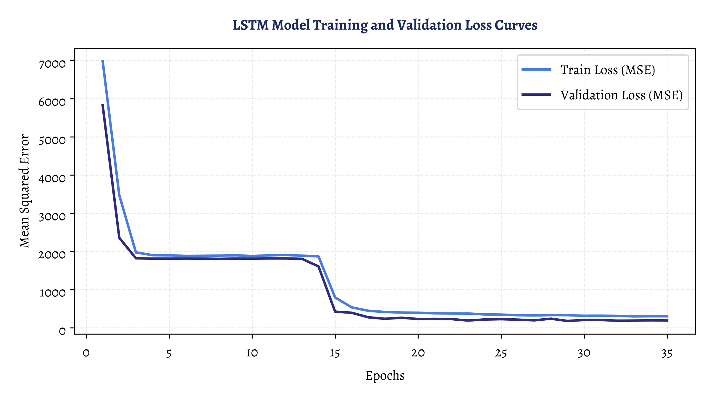
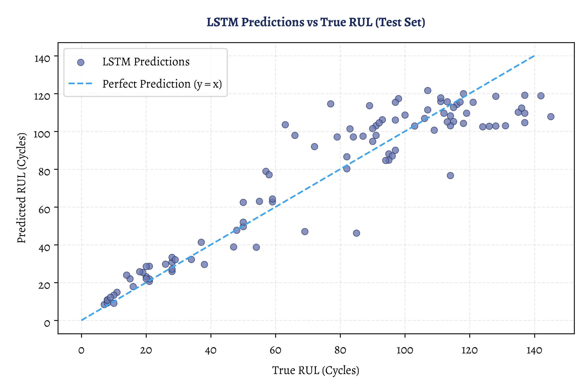

# Deep Sequence Modeling Report: NASA C-MAPSS Dataset (FD001)

This report provides a comprehensive explanation of the deep learning model building carried out in **03_deep_model.ipynb**. It covers the transition from baseline models, group-based splitting, PyTorch LSTM network architecture, model training, loss convergence, and final test evaluation, including interpretations and key code blocks.

---

## The Transition from Notebook 2 (Baseline) to Notebook 3 (LSTM)

In **02_baseline_model.ipynb**, we trained classical machine learning models (Linear Regression, Random Forest, XGBoost) using **manual feature engineering**. For each 30-cycle sliding window, we computed the rolling mean, standard deviation, and slope. This process collapsed the temporal dimension, transforming a sequence of shape `(30, 14)` into a flat 42-dimensional vector. While effective, this approach throws away sequential ordering and temporal dependencies, and relies on human assumption about what features (mean, std, slope) are important.

In **03_deep_model.ipynb**, we transition to a **Deep Sequence Model** using a recurrent neural network (LSTM). The LSTM (Long Short-Term Memory) directly ingests the 3D sequence tensor `(samples, seq_len, features)`. This allows the model to:
1. **Preserve Time Ordering**: Learn step-by-step how sensor values evolve cycle-by-cycle.
2. **Representation Learning**: Automatically extract complex temporal features and multi-sensor interactions without manual calculation of mean or slope.
3. **Handle Multi-scale Dynamics**: Capture slow, long-term degradation patterns alongside rapid transient changes.

---

## 1. Group-Based Split, Scaling, and Windowing

To build a reliable deep learning pipeline, we must split our training engines carefully and scale features to avoid data leakage.

### Key Code Block (Data Splitting & Sequence Creation)
```python
# 1. Group-based train/val split (units 1-80: train, units 81-100: val)
train_units = train_df[train_df['unit'] <= 80].copy()
val_units = train_df[train_df['unit'] > 80].copy()
test_units = test_df.copy()

# 2. Fit scaler on training units only, transform all
scaler = MinMaxScaler()
train_units[KEEP_SENSORS] = scaler.fit_transform(train_units[KEEP_SENSORS])
val_units[KEEP_SENSORS] = scaler.transform(val_units[KEEP_SENSORS])
test_units[KEEP_SENSORS] = scaler.transform(test_units[KEEP_SENSORS])

# Helper to build sliding windows of shape (samples, window_size, features)
def create_sequences(df, window_size=30):
    X, y = [], []
    for unit, group in df.groupby('unit'):
        features = group[KEEP_SENSORS].values
        targets = group['RUL'].values
        for i in range(len(group) - window_size + 1):
            X.append(features[i : i + window_size])
            y.append(targets[i + window_size - 1])
    return np.array(X, dtype=np.float32), np.array(y, dtype=np.float32)
```

### Interpretation
- **Group-Based Validation Split**: Instead of splitting windows randomly, we split by engine unit (units 1-80 for training, units 81-100 for validation). A random split would cause severe **data leakage** because overlapping sliding windows from the same engine would end up in both training and validation sets, artificially boosting validation scores.
- **Min-Max Scaling**: The scaler is fitted strictly on the training units and then applied to validation and test units. This ensures that the validation and test features do not leak target-related statistics into the training process.
- **3D Sequence Input**: The resulting `X_train` has shape `(14138, 30, 14)`, meaning 14,138 sequences, each 30 cycles long, containing 14 sensor signals.

---

## 2. PyTorch Dataset, DataLoader, and LSTM Model Architecture

We pack the sequences into standard PyTorch utilities and define our network architecture.

### Key Code Block (Dataset & Model Definition)
```python
class CMAPSSDataset(Dataset):
    def __init__(self, X, y):
        self.X = torch.tensor(X, dtype=torch.float32)
        self.y = torch.tensor(y, dtype=torch.float32).unsqueeze(1)
        
    def __len__(self):
        return len(self.X)
        
    def __getitem__(self, idx):
        return self.X[idx], self.y[idx]

class LSTMRulModel(nn.Module):
    def __init__(self, input_dim, hidden_dim, num_layers=2, dropout=0.2):
        super().__init__()
        self.lstm = nn.LSTM(
            input_dim, 
            hidden_dim, 
            num_layers=num_layers, 
            batch_first=True, 
            dropout=dropout
        )
        self.regressor = nn.Sequential(
            nn.Linear(hidden_dim, 32),
            nn.ReLU(),
            nn.Dropout(dropout),
            nn.Linear(32, 1)
        )
        
    def forward(self, x):
        # LSTM output shape: (batch_size, seq_len, hidden_dim)
        out, _ = self.lstm(x)
        # Take the hidden state of the final time step
        last_time_step_out = out[:, -1, :]
        return self.regressor(last_time_step_out)
```

### Interpretation
- **DataLoader**: Batches sequences in groups of 128 and shuffles training batches, enabling stable Stochastic Gradient Descent.
- **LSTM Layers**: A 2-layer LSTM with a hidden size of 64. For each sample, the LSTM processes the 30 time steps sequentially. The final step's hidden state (which theoretically contains context from all previous cycles in the window) is extracted via `out[:, -1, :]`.
- **Dropout & Linear Head**: A dropout rate of 0.2 is applied between the LSTM layers and inside the regression head to regularize weights and prevent overfitting. The final state is passed through a dense layer, a ReLU activation, and a final linear regressor to output a single predicted RUL value.

---

## 3. Training Loop and Loss Curves

The model is trained for 35 epochs using the Mean Squared Error (MSE) loss and the Adam optimizer ($lr=0.001$). Train and validation losses are computed at the end of each epoch to monitor convergence.

### Loss Curves Plot


### Interpretation
- **Loss Convergence**: Both training and validation losses drop rapidly during the first 10 epochs. 
- **Overfitting Verification**: The training loss converges to **299.66** (RMSE $\approx$ 17.31 cycles), and the validation loss stabilizes around **189.57** (RMSE $\approx$ 13.77 cycles). Because the validation loss tracks closely with the training loss and does not begin to rise, we can confirm the model has successfully generalized without overfitting.

---

## 4. Evaluation on Test Set

The trained model is evaluated on the 100 test engines using only their final 30-cycle window to predict RUL at truncation.

### Summary of LSTM Model Results

| Metric | Value |
| :--- | :---: |
| **Test RMSE** | 14.87 Cycles |
| **Test PHM08 Score** | 352.64 |

### Interpretation & Baseline Comparison

Comparing these results to the classical ML baselines from Notebook 2 shows a nuanced picture:

- **RMSE Comparison**: The LSTM's Test RMSE of **14.87** outperforms Linear Regression (16.29) but lags slightly behind Random Forest (13.53) and XGBoost (13.29).
- **PHM08 Score Comparison**: The LSTM's PHM08 score of **352.64** is better than Linear Regression (440.77) but is higher than Random Forest (266.48) and XGBoost (249.40).
- **Why did XGBoost beat the LSTM?**: 
  - **Dataset Size**: Deep sequence models like LSTMs have thousands of parameters and are highly data-hungry. The C-MAPSS FD001 dataset has only 100 training engine runs, which is relatively small for deep neural networks.
  - **Explicit Feature Advantage**: Classical tree models (XGBoost/RF) in Notebook 2 were fed the *rolling slope/trend* feature. This explicit mathematical gradient gives the models immediate indicators of degradation rates. The LSTM has to learn to compute representations of these trends implicitly from raw normalized sensor streams, which typically requires larger datasets, longer sequence context, or more rigorous hyperparameter tuning to outperform engineered tree models.

---

## 5. Sample Engine Predictions Analysis

The scatter plot below compares the predicted RUL values directly against the true RUL values for the 100 test engines.

### Predictions Scatter Plot


### Interpretation
- **Alignment with Diagonal**: The predictions cluster closely around the ideal diagonal line ($y=x$), demonstrating that the LSTM has successfully learned to predict Remaining Useful Life.
- **High-RUL Cap**: The horizontal line of predictions near the True RUL value of 125 represents the piecewise capping boundary. The model correctly outputs predictions near 120-125 when the engine has not yet begun to degrade.
- **Low-RUL Clustering**: For engines near failure (True RUL $< 40$), predictions remain tightly bound to the diagonal line, indicating that the model's accuracy increases as the engine approaches a critical wear state.
